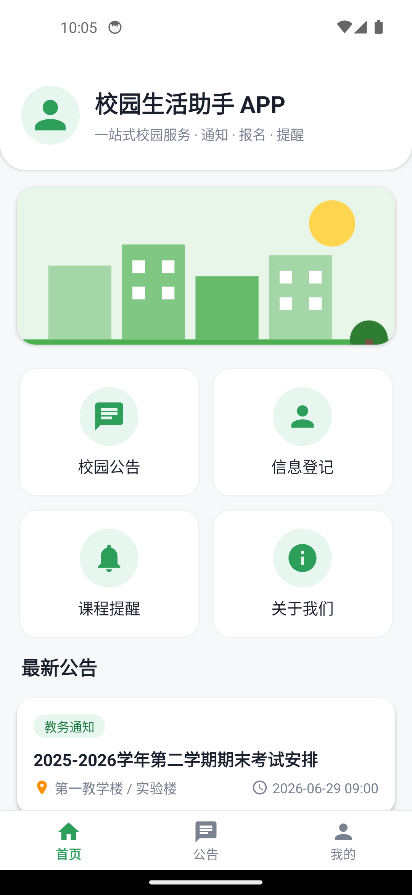
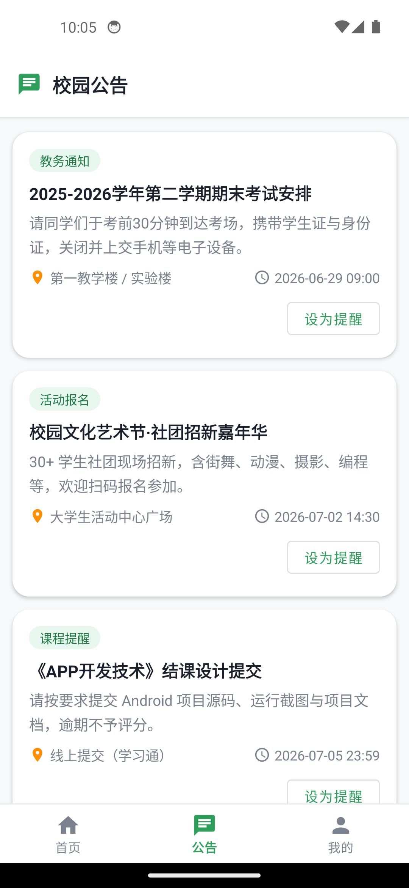
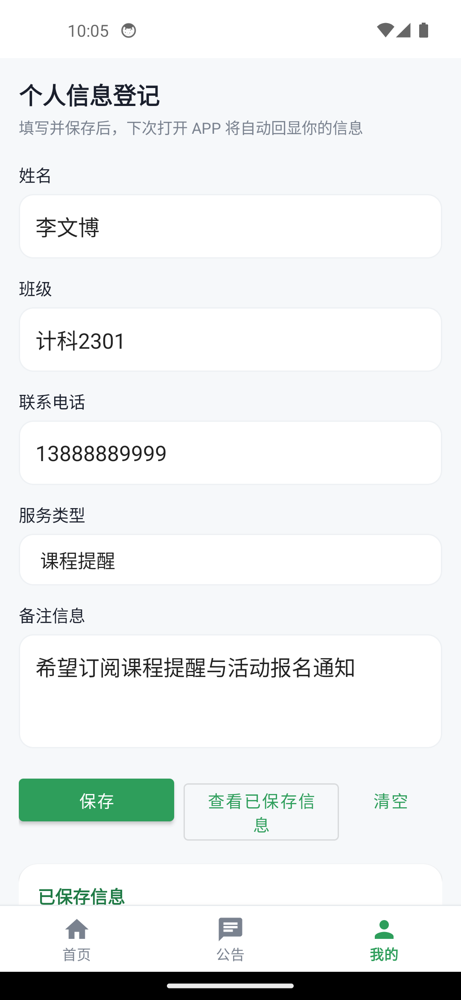
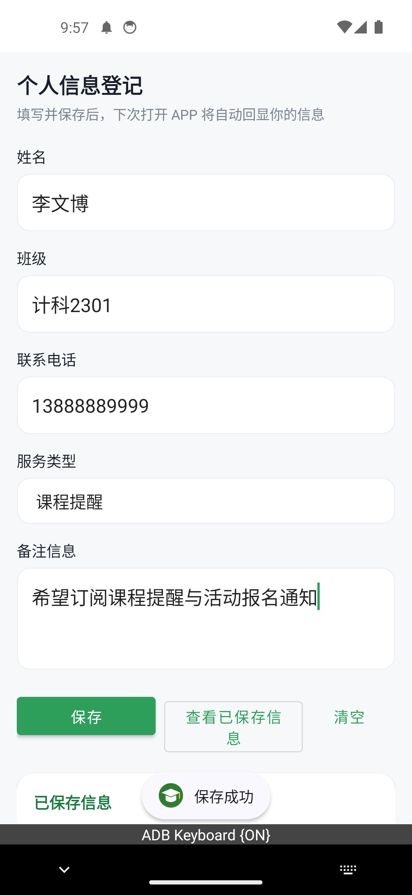
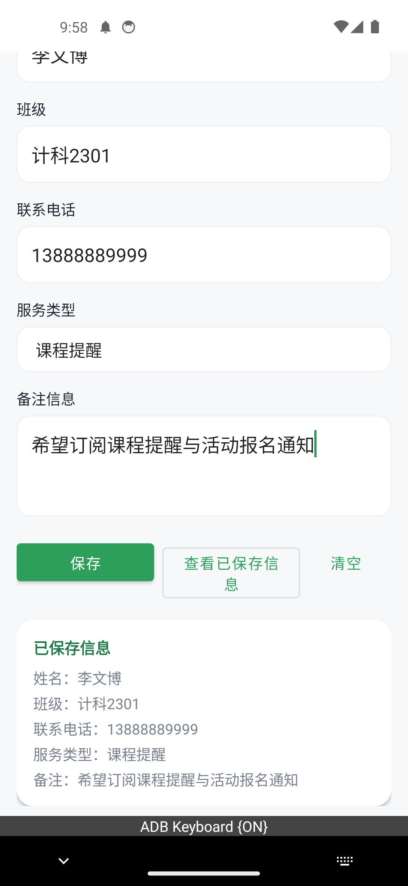
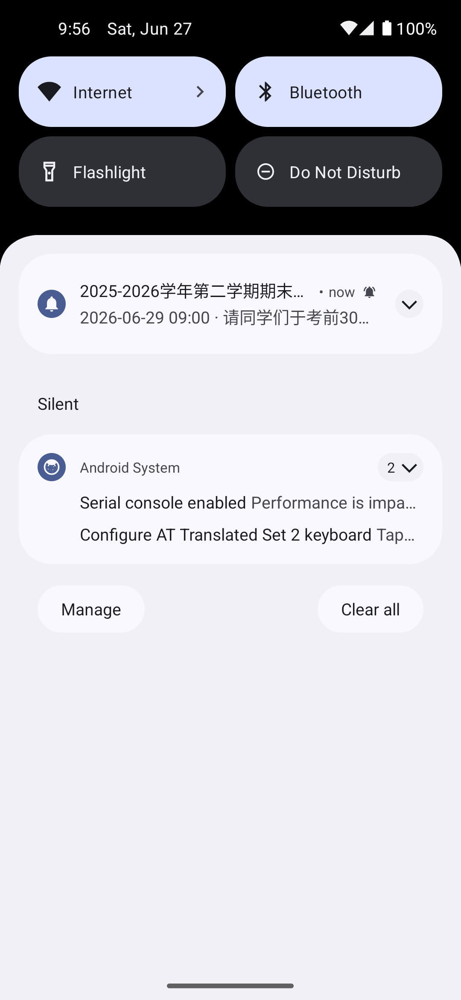

# 校园生活助手 APP（CampusLife）

> 《APP 开发技术》期末结课设计作品 —— 一个基于 Android 原生（Java）开发的一站式校园服务应用。

本项目依据仓库中的试卷文档 `APP技术开发期末试卷B(3).docx` 的要求开发，覆盖"项目文档与总体设计、界面设计与布局、信息输入与交互、本地数据保存与回显、服务类扩展功能、源代码与代码质量"六个评分维度。

---

## 一、项目背景与设计目标

### 1.1 项目背景
大学校园中，学生每天需要关注教务通知、活动报名、课程安排、失物招领、便民服务等大量分散信息，缺少一个统一入口。本项目设计并实现"校园生活助手 APP"，将常用校园服务聚合到一个移动端应用中。

### 1.2 设计目标
- 提供清晰美观的首页，集中展示校园服务入口与最新公告。
- 支持个人信息登记并本地持久化，再次打开自动回显，免去重复填写。
- 通过本地数据读取展示校园公告列表，并支持"课程/活动提醒"通知。
- 代码结构清晰、命名规范、运行稳定，便于维护与演示。

### 1.3 主要用户需求
| 用户 | 需求 |
| --- | --- |
| 在校学生 | 快速查看校园公告、报名活动、接收课程提醒 |
| 新生 | 登记并保存个人信息，了解校园服务分类 |
| 普通用户 | 查询便民服务、失物招领信息 |

---

## 二、系统结构与技术路线

应用采用 Android 原生四大组件 + 单 Activity（底部导航）多 Fragment 的经典结构，各模块关系如下：

```
┌─────────────────────────────────────────────────────────────┐
│                        用户交互层 (UI)                          │
│  MainActivity + BottomNavigationView                          │
│   ├ HomeFragment(首页) ├ NoticeFragment(公告) ├ ProfileFragment │
│  Layout: ConstraintLayout / LinearLayout / GridLayout / Card  │
└───────────────┬───────────────────────────┬──────────────────┘
                │                           │
        ┌───────▼────────┐         ┌────────▼─────────┐
        │  本地数据保存层   │         │   资源 / 数据读取层 │
        │ SharedPreferences│        │ assets/notices.json│
        │ (多字段持久化)    │        │ NoticeRepository   │
        └────────────────┘         └────────┬─────────┘
                                            │
                              ┌─────────────▼──────────────┐
                              │       服务 / 提醒层           │
                              │ ReminderService(Service)    │
                              │   → sendBroadcast()         │
                              │ ReminderReceiver(Receiver)  │
                              │   → Notification(系统通知)   │
                              └─────────────────────────────┘
```

技术路线：用户通过底部导航在 Fragment 间切换 → Fragment 处理交互 → 通过 `SharedPreferences` 保存/回显数据、通过 `NoticeRepository` 读取并解析本地 JSON → 列表展示 → "设为提醒"触发 `Service`，`Service` 读取数据后发送广播 → `BroadcastReceiver` 弹出系统 `Notification`。

---

## 三、功能模块图与核心模块说明

```
校园生活助手 APP
├── 主框架 (MainActivity + 底部导航 BottomNavigationView)
│   └── 首页 / 公告 / 我的 三个标签页切换
├── 首页模块 (HomeFragment)
│   ├── 标题 / 头像 / 副标题
│   ├── 主题 Banner 图片
│   ├── 功能图标区（公告 / 登记 / 提醒 / 关于）
│   └── 最新公告卡片（主题服务信息展示）
├── 信息登记模块 (ProfileFragment)
│   ├── 多字段输入（姓名 / 班级 / 电话 / 服务类型 / 备注）
│   ├── 保存 / 查看 / 清空 交互
│   └── SharedPreferences 持久化 + 自动回显
├── 校园公告模块 (NoticeFragment)
│   ├── 本地 JSON 读取与解析 (NoticeRepository)
│   ├── RecyclerView 列表展示 (NoticeAdapter)
│   └── "设为提醒"入口
└── 提醒服务模块
    ├── ReminderService（后台读取数据）
    ├── ReminderReceiver（接收广播）
    └── Notification（系统通知提醒）
```

核心模块说明：
- **主框架 MainActivity**：承载 `BottomNavigationView`，在「首页 / 公告 / 我的」三个 Fragment 间切换；启动即创建通知渠道并申请通知权限。
- **首页 HomeFragment**：聚合功能入口与最新公告展示，公告/登记入口会切换到对应底部标签。
- **信息登记 ProfileFragment**：演示输入、交互、本地保存与回显；使用 `SharedPreferences` 保存姓名、班级、电话、服务类型、备注等多个字段。
- **公告列表 NoticeFragment + NoticeRepository + NoticeAdapter**：读取 `assets/notices.json`，解析为 `Notice` 列表并通过 `RecyclerView` 展示。
- **提醒服务 ReminderService / ReminderReceiver**：完整体现 Service → 广播 → 通知的提醒链路。

---

## 四、使用说明

1. 打开 APP 进入首页，可看到标题、Banner 图、四个功能入口与"最新公告"卡片；底部导航栏可在 **首页 / 公告 / 我的** 之间切换。
2. 点击底部 **公告**（或首页的校园公告入口）进入公告列表，浏览教务通知、活动报名、课程提醒、失物招领、便民服务等信息；点击某条公告的 **设为提醒**，通知栏会弹出该公告提醒。
3. 点击底部 **我的**（或首页的信息登记入口）进入登记页，填写姓名、班级、联系电话、选择服务类型、填写备注，点击 **保存**，提示"保存成功"并在下方回显；**再次打开 APP / 进入该页面会自动回显上次保存的信息**。点击 **查看已保存信息** 可随时查看，**清空** 可删除本地数据。
4. 首页点击 **课程提醒**，后台服务读取本地课程提醒数据并通过通知栏推送提醒。
5. 点击 **关于我们** 查看应用信息。

> Android 13 及以上系统首次运行会申请"通知"权限，授予后可正常收到提醒通知。

---

## 五、开发说明

### 5.1 运行环境
- Android Studio（建议 Giraffe / Hedgehog 及以上）
- JDK 17
- Android Gradle Plugin 8.5.2 / Gradle 8.7
- compileSdk / targetSdk 34，minSdk 26

### 5.2 关键代码说明
- **底部导航切换** —— `MainActivity` 通过 `BottomNavigationView.setOnItemSelectedListener` 用 `FragmentTransaction.replace()` 切换三个 Fragment。
- **本地保存（SharedPreferences）** —— `ProfileFragment#saveProfile()` / `restoreProfile()`：以多个 key 保存多字段，`onViewCreated` 中调用 `restoreProfile()` 实现自动回显。
- **本地 JSON 读取解析** —— `NoticeRepository#loadNotices()`：从 `assets` 读取文件，用 `org.json` 解析为 `Notice` 列表，解析失败安全返回空列表，避免闪退。
- **Service + 广播 + 通知** —— `ReminderService#onHandleIntent()` 读取数据后 `sendBroadcast()`；`ReminderReceiver#onReceive()` 构建并弹出 `NotificationCompat` 通知；`NotificationHelper` 统一创建通知渠道。
- **列表展示** —— `NoticeAdapter` 绑定 `item_notice.xml`，并通过回调接口处理"设为提醒"点击。

### 5.3 项目文件结构
```
better02/
├── app/
│   ├── build.gradle                 # 模块构建脚本与依赖
│   └── src/main/
│       ├── AndroidManifest.xml      # 组件与权限声明
│       ├── assets/notices.json      # 本地公告数据
│       ├── java/com/campuslife/app/
│       │   ├── MainActivity.java        # 主框架 + 底部导航
│       │   ├── HomeFragment.java        # 首页
│       │   ├── ProfileFragment.java     # 信息登记 + 本地保存/回显
│       │   ├── NoticeFragment.java      # 公告列表
│       │   ├── Notice.java              # 数据模型
│       │   ├── NoticeRepository.java    # 本地 JSON 读取解析
│       │   ├── NoticeAdapter.java       # 列表适配器
│       │   ├── ReminderService.java     # 提醒服务
│       │   ├── ReminderReceiver.java    # 提醒广播接收者
│       │   └── NotificationHelper.java  # 通知渠道
│       └── res/                     # 布局、图标、颜色、主题等资源
├── build.gradle / settings.gradle   # 项目级构建脚本
├── docs/                            # 项目文档与运行截图
└── README.md
```

### 5.4 构建与运行
```bash
# 命令行编译生成调试包
./gradlew assembleDebug
# 产物位置：app/build/outputs/apk/debug/app-debug.apk

# 或使用 Android Studio：File > Open 选择本目录，连接模拟器/真机后点击 Run
```

## 六、运行截图

| 首页（底部导航） | 公告列表 | 我的（信息登记） |
| :---: | :---: | :---: |
|  |  |  |

| 保存成功 | 数据回显 | 通知提醒 |
| :---: | :---: | :---: |
|  |  |  |

> 以上截图在 Android 模拟器（Pixel 5 / Android 14）实机运行采集。
