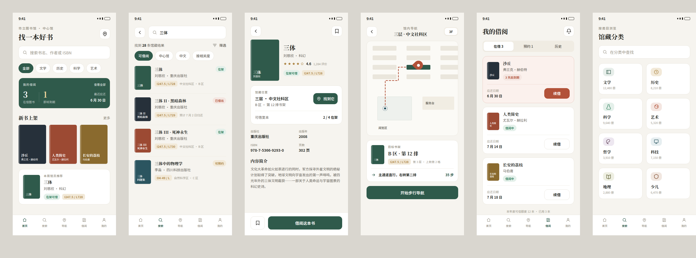

# 图书馆找书 · Figma UI 设计

主题：**图书馆找书**（移动端 App）。白色（暖纸白）主调，编辑感 / 书卷气配色，刻意避免常见的 AI 生成风格（无紫色渐变、无玻璃拟态、无堆砌的 emoji）。

- 交付文件：[`图书馆找书.fig`](./图书馆找书.fig) —— 真正的 Figma `.fig` 二进制文件（不是图片、不是导入插件）。
- 预览：



## 包含 6 个页面（画板）

| # | 页面 | 内容 |
|---|------|------|
| 01 | 首页 · 发现 | 搜索框、分类标签、我的借阅概览、新书上架、馆员推荐 |
| 02 | 搜索结果 | 关键词、筛选标签、馆藏列表（封面 / 索书号 / 馆藏位置 / 在架状态） |
| 03 | 图书详情 | 封面、评分、馆藏位置 + "找到它"、出版信息、内容简介、借阅按钮 |
| 04 | 馆内导航 | 楼层书架平面图、路线、当前位置 / 目标书架、步行导航 |
| 05 | 我的借阅 | 在借 / 预约 / 历史，到期提醒、续借 |
| 06 | 馆藏分类 | 分类网格（文学 / 历史 / 科学 / 艺术 …） |

打开后：每个 SVG 图标是可编辑的**矢量图层**，所有文字是可编辑的**文本图层**（思源黑体 / 思源宋体，Figma 自带），颜色、圆角、阴影、自动布局结构均保留。

## 如何打开

把 `图书馆找书.fig` 拖到 Figma 文件面板（dashboard）即可导入为一个新文件；或 Figma 桌面端 `File → Import`。

> 说明：`.fig` 是 Figma 私有二进制格式。本文件通过逆向 Figma 的 kiwi 归档格式（schema 版本 106）生成，并已用 Figma 自带的 schema 解码校验通过（详见 `generator/`）。

## 如何重新生成 / 修改

设计源是一份标准 HTML（`generator/library.html`）。改完 HTML 后重新跑生成脚本即可产出新的 `.fig`：

```bash
cd generator
npm install
npm run fonts        # 下载用于度量的 Noto 变量字体（不入库）
npm run build        # 用 esbuild 打包 dom-to-figma 转换器
python3 -m http.server 8123 &   # 本地静态服务（给浏览器加载字体/页面）
npm run generate     # 启动 Chrome(CDP) → DOM 转 Figma 节点 → 写出 ../图书馆找书.fig
npm run validate     # 用 Figma 的 kiwi schema 解码校验产物
```

原理：`dom-to-figma` 在真实 Chrome 里读取每个页面的计算样式与布局，转成 Figma 的 `NODE_CHANGES` 节点树（DOCUMENT → CANVAS → 6 个 FRAME），再用 kiwi 二进制 schema 编码、deflate、拼成 `fig-kiwi` 归档。
